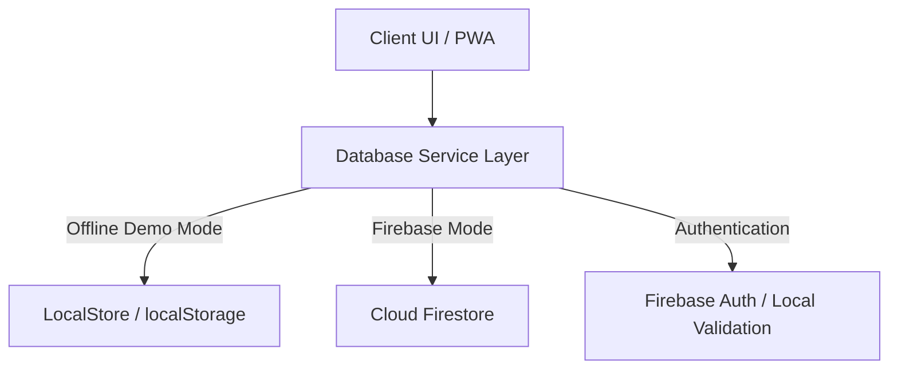

# Application Architecture - Fitness Corner Gym

This document details the architectural layout, state management, and design patterns utilized in the Fitness Corner Gym GMS PWA.

---

## 🏗 High-Level Architecture

FCG is structured using a **Mobile-First Single-Page Application (SPA)** model leveraging Next.js 15 App Router. The application utilizes a hybrid database access model to ensure seamless offline demonstrations while maintaining cloud synchronicity.

### 1. Unified Service Layer
All data reads and writes go through `src/lib/db/service.ts`. The service checks the static global variable `DEMO_MODE`:
* **Demo Mode = Active**: Performs mutations against local storage through the `LocalStore` state manager. It simulates network latency (using custom async delays) to mimic real-world database queries.
* **Demo Mode = Inactive**: Performs CRUD operations directly against Cloud Firestore and authenticates users via Firebase Authentication.

### 2. Route Organization & Access Controls
Route routing is organized into Next.js Route Groups to isolate layouts and middleware actions:
* `(public)`: Public marketing website containing static and SEO-optimized directories (`/about`, `/become-member`).
* `(member)`: Member actions. Protected by code verification checks.
* `(coach)`: Coach operational console. Protected by coach session verification.
* `(owner)`: Owner dashboard. Protected by owner administrative controls.

---

## 💾 State Management Pattern

The application leverages Next.js client-side React states combined with a custom reactive persistence utility (`LocalStore`):
1. **LocalStore**: A TypeScript wrapper around `localStorage` that manages schema migrations, seeds default operational datasets, and exposes reactive getters and setters.
2. **Theme State**: Handled using `next-themes` and Tailwind CSS variable mappings to switch dynamically between light and dark glassmorphic representations.
